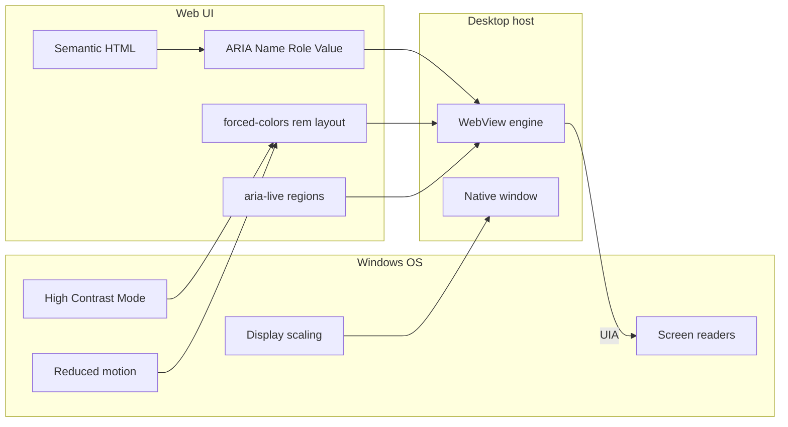

# Desktop App Accessibility Template

Reusable checklist and patterns for Windows desktop applications that must meet **WCAG 2.1 Level AA** (equivalent) under Israel's **Equal Rights for Persons with Disabilities Law**. Based on the CMS PyWebView/WebView2 implementation (merged to `main` via PR #35, originally on branch `user-accessibility`).

Copy this file into a new project and fill in the `[PLACEHOLDER]` sections.

---

## 1. Legal and technical context

| Item | Your app |
|------|----------|
| Application name | `[APP NAME]` |
| Platform | Windows desktop |
| UI stack | `[e.g. PyWebView + WebView2, Electron, WPF + WebView2]` |
| Public service? | `[Yes / No — if yes, accessibility statement is required]` |
| Target standard | WCAG 2.1 Level AA (IS 5568 aligned where applicable) |

### How accessibility works on WebView2

You do **not** call UI Automation (UIA) from Python or the host directly for web content. Chromium maps **semantic HTML + ARIA** to UIA:

```
HTML + ARIA  →  Chromium a11y tree  →  Windows UIA  →  NVDA / Narrator / JAWS
```

Native OS dialogs (file pickers, folder pickers) inherit Windows accessibility automatically.

| Layer | Component | Accessibility role |
|-------|-----------|-------------------|
| Host window | `[PyWebView / WinForms / WPF]` | Window chrome → UIA |
| UI content | HTML/CSS/JS | Chromium tree → UIA |
| Native dialogs | `[webview.FOLDER_DIALOG, etc.]` | OS picker → UIA |
| Backend | `[API bridge, no visual UI]` | Announce state changes in the web layer |

---

## 2. Architecture (reference)



---

## 3. Design principles

1. **Use OS settings, not in-app duplicates** — Respect Windows High Contrast, display scaling, and reduced motion. Do not add custom font-size or contrast toggles unless there is a documented gap OS settings cannot cover.
2. **ARIA is your UIA API** — For embedded web UI, correct roles, names, and states are mandatory for screen readers.
3. **Keyboard-first** — Every action reachable by Tab; visible `:focus-visible`; modals trap focus.
4. **Announce state changes** — Loading, errors, wizard steps, and toasts must use live regions, not visual-only feedback.
5. **Contrast before aesthetics** — Fix failing pairs (e.g. white on bright accent) with dark text or darker backgrounds, not by removing focus rings.
6. **Offline-first assets** — Self-host fonts and icons; do not depend on CDN or network at startup (required in locked-down / air-gapped environments).

---

## 4. Implementation phases

### Phase 0 — Host application

| Task | Done | Notes |
|------|------|-------|
| Enable text selection if host disables it (`text_select=True` in pywebview) | ☐ | Users may need to copy errors, license text |
| Self-host web fonts (`@font-face` + local `woff2`; no Google Fonts / CDN) | ☐ | Main UI: `src/web/fonts/`; splash may use system stack if standalone |
| Window title set and meaningful | ☐ | `[WINDOW TITLE]` |
| Native dialogs verified with Narrator from keyboard | ☐ | |
| Minimum WebView2 runtime documented | ☐ | `[RUNTIME VERSION]` |

### Phase 1 — Semantic HTML and automation mapping

| UI component | HTML/ARIA | Name source |
|--------------|-----------|-------------|
| Page title | `<h1>` (visible or visually hidden) | App name |
| Regions | `<header>`, `<nav>`, `<main>`, `<footer>` | Landmarks |
| Skip link | `<a href="#main-content" class="skip-link">` | First focusable |
| Modals | `role="dialog" aria-modal="true" aria-labelledby` | `<h2>` title id |
| Close (✕) | `button` + `aria-label="[Close in locale]"` | Not symbol alone |
| Forms | `<label for="...">` or `aria-label` | Every input |
| Tables | `<caption>`, `scope="col"` on `<th>` | |
| Checkboxes | `aria-label="[Action]: [item name]"` | Dynamic in JS |
| Custom chips/lists | `<button type="button">` not `<div onclick>` | |
| Images | Descriptive `alt` or `alt=""` + adjacent text | |
| Wizard/tour steps | Hidden live region or announcer | |
| Startup splash status | `#splash-hint` with `aria-live="polite"` | IDEA/COM errors, retry state |
| Startup failure actions | `<button type="button">` retry + exit | Keyboard reachable; `await` PyWebView API calls |

**App-specific checklist:**

- ☐ `[LIST UNIQUE COMPONENTS: wizards, data grids, custom pickers]`
- ☐ Startup splash: errors announced in live region; retry/exit not mouse-only
- ☐ Splash strings in app locale (CMS gap: some English on splash hint/errors)

### Phase 2 — Modal focus management

Implement centralized helpers (adapt names/paths):

```javascript
let _modalFocusReturn = null;
let _focusTrapHandler = null;
const FOCUSABLE = 'button:not([disabled]), [href], input:not([disabled]), select:not([disabled]), textarea:not([disabled]), [tabindex]:not([tabindex="-1"])';

function getFocusableElements(container) {
    return Array.from(container.querySelectorAll(FOCUSABLE))
        .filter(el => el.offsetParent !== null || el === document.activeElement);
}

function openModal(id, focusSelector) {
    const el = document.getElementById(id);
    _modalFocusReturn = document.activeElement;
    el.style.display = 'flex';
    el.setAttribute('aria-hidden', 'false');
    document.getElementById('main-content')?.setAttribute('aria-hidden', 'true');
    const content = el.querySelector('.modal-content');
    let target = focusSelector ? el.querySelector(focusSelector) : null;
    if (!target && content) target = getFocusableElements(content)[0];
    target?.focus();
    trapFocus(el);
}

function closeModal(id) {
    const el = document.getElementById(id);
    el.style.display = 'none';
    el.setAttribute('aria-hidden', 'true');
    releaseFocusTrap();
    if (!document.querySelector('.modal-overlay[style*="flex"]')) {
        document.getElementById('main-content')?.removeAttribute('aria-hidden');
    }
    _modalFocusReturn?.focus();
    _modalFocusReturn = null;
}
```

| Task | Done |
|------|------|
| All modals use `openModal` / `closeModal` | ☐ |
| Tab trapped inside active dialog | ☐ |
| Esc closes top modal; focus returns to trigger | ☐ |
| Enter confirms when appropriate (not in inputs) | ☐ |

**Modal inventory:** `[MODAL_ID_1]`, `[MODAL_ID_2]`, …

### Phase 3 — Keyboard operability

| Task | Done |
|------|------|
| No mouse-only controls (div onclick, double-click only) | ☐ |
| Visible keyboard path for every action | ☐ |
| Global `:focus-visible` (2px outline, 3:1 contrast) | ☐ |
| No positive `tabindex` except skip link pattern | ☐ |
| Tooltips/info on `:focus-within` + `aria-describedby` | ☐ |

### Phase 4 — Screen reader live announcements

| Region | ARIA | When it updates |
|--------|------|-----------------|
| Toast container | `role="status" aria-live="polite"` | Success/info |
| Error toasts | `role="alert"` | Errors, warnings |
| Loading text | `aria-live="assertive"` | Long operations |
| Status labels | `aria-live="polite"` | Counts, license, project name |
| Wizard/tour steps | Hidden live region or announcer | Step changes |
| Startup splash | `#splash-hint` `aria-live="polite"` | Connection failures before main UI loads |

| Task | Done |
|------|------|
| Single `showAlert` / notification implementation | ☐ |
| Loading overlay `aria-busy` + `aria-hidden` toggled | ☐ |
| UI strings in app locale (no stray English) | ☐ |
| PyWebView bridge calls that exit or block use `await` in async handlers | ☐ |

### Phase 5 — OS-level settings (CSS)

Add to global stylesheet:

```css
/* Self-hosted fonts — required for offline / air-gapped installs */
@font-face {
    font-family: 'Rubik';
    src: url('fonts/Rubik-Regular.woff2') format('woff2');
    font-weight: 400;
    font-style: normal;
    font-display: swap;
}

html { font-size: 100%; }
body { font-family: 'Rubik', 'Segoe UI', 'Arial', sans-serif; }
```

Standalone splash pages (materialized to temp with inline CSS) may use a **system font stack** instead of embedding `@font-face`, unless you materialize font URIs the same way as image assets.

Add OS media queries:

@media (prefers-contrast: more) {
    :root {
        --text-secondary: /* darker */;
        --border-color: /* stronger */;
    }
}

@media (forced-colors: active) {
    :root {
        --bg-color: Canvas;
        --text-primary: CanvasText;
        --border-color: CanvasText;
        --primary-btn: Highlight;
    }
    button, input, select, textarea {
        border: 1px solid CanvasText;
    }
}

@media (prefers-reduced-motion: reduce) {
    *, *::before, *::after {
        animation-duration: 0.01ms !important;
        animation-iteration-count: 1 !important;
        transition-duration: 0.01ms !important;
    }
    .spinner { display: none; }
}
```

| Task | Done |
|------|------|
| Font sizes in `rem` / `em`, not fixed `px` | ☐ |
| Splash/startup animations respect reduced motion | ☐ |
| Splash uses system fonts or self-hosted `@font-face` (never CDN) | ☐ |
| No in-app font/contrast/motion toggles (unless justified) | ☐ |

### Phase 6 — Visual presentation (default theme AA)

Audit and fix before relying on High Contrast mode:

| Pair | Requirement | Your fix |
|------|-------------|----------|
| Body text on background | ≥ 4.5:1 | ☐ |
| Large / bold text | ≥ 3:1 | ☐ |
| Primary / accent buttons | ≥ 4.5:1 for label | ☐ `[e.g. dark text on #f5a623]` |
| Top bar / chrome | ≥ 4.5:1 at used size | ☐ |
| Focus ring | ≥ 3:1 vs adjacent | ☐ |
| Disabled / placeholder text | Still readable or clearly disabled | ☐ |

**200% display scale / reflow:**

| Task | Done |
|------|------|
| `body { min-height: 100vh; overflow: auto }` (not `overflow: hidden`) | ☐ |
| Toolbars `flex-wrap: wrap` | ☐ |
| Wide tables in `overflow-x: auto` container | ☐ |
| Multi-column modals stack at `@media (max-width: 40em)` | ☐ |

### Phase 7 — Motion

| Animation | Reduced-motion behavior |
|-----------|-------------------------|
| Loading spinner | Hidden; text remains |
| Modal enter/exit | Disabled |
| Splash pulse | Disabled |
| Auto-playing video | N/A or provide pause — `[N/A]` |

### Phase 8 — Accessibility statement (required for public services)

Provide Hebrew + English (or your locales) in a modal or dedicated page.

**Sections to include:**

1. Application name and purpose  
2. Commitment (Equal Rights Law; WCAG 2.1 AA target)  
3. Technology (desktop + WebView2 + UIA)  
4. Supported assistive technologies  
5. OS settings respected  
6. Conformance level (`partial` / `full`) and known gaps  
7. Contact: `[NAME]`, `[EMAIL]`, `[PHONE]`  
8. Last updated: `[DATE]`  
9. Feedback / remediation timeline (e.g. 30 business days)

Link from footer and/or help menu: `[הצהרת נגישות / Accessibility Statement]`

### Phase 9 — Verification

#### Manual (Windows)

| # | Test | Pass |
|---|------|------|
| 1 | Tab through entire app — all actions reachable | ☐ |
| 2 | NVDA or Narrator announces Name/Role/Value correctly | ☐ |
| 3 | Windows High Contrast — all controls visible and operable | ☐ |
| 4 | Display scale 200% — no clipped critical controls | ☐ |
| 5 | Reduced motion — no spinning/pulsing | ☐ |
| 6 | Each modal — focus trapped, Esc closes, focus returns | ☐ |
| 7 | Errors/loading/saves announced without looking at screen | ☐ |
| 8 | Native file/folder dialog usable with screen reader | ☐ |
| 9 | Startup splash failure — error in live region; retry/exit by keyboard | ☐ |
| 10 | App works offline (no CDN fonts/scripts blocking render) | ☐ |

#### Automated

| Task | Done |
|------|------|
| Existing unit tests still pass | ☐ |
| Public-function coverage gate passes (`scripts/check_test_coverage.py`) | ☐ |
| Optional: axe in debug WebView / Accessibility Insights scan | ☐ |

---

## 5. Reusable CSS utilities

```css
.visually-hidden {
    position: absolute;
    width: 1px;
    height: 1px;
    padding: 0;
    margin: -1px;
    overflow: hidden;
    clip: rect(0, 0, 0, 0);
    white-space: nowrap;
    border: 0;
}

.skip-link {
    position: absolute;
    top: -100px;
    right: 16px;
    z-index: 10001;
    padding: 10px 16px;
    background: var(--primary-btn);
    color: #fff;
}

.skip-link:focus {
    top: 16px;
    outline: 2px solid #fff;
    outline-offset: 2px;
}

:focus-visible {
    outline: 2px solid var(--primary-btn);
    outline-offset: 2px;
}
```

---

## 6. Contrast pattern for brand accent colors

If brand accent is a bright color (e.g. `#f5a623`):

- **Do not** use white text on bright accent for normal-sized buttons (~2:1, fails AA).
- **Do** use dark text on accent: `--accent-text: #1a2237` on `.action-btn.primary`.
- **Hover** may use slightly darker accent + white text if contrast passes.

---

## 7. File checklist (typical WebView app)

| File | Changes |
|------|---------|
| `[index.html / main UI]` | Landmarks, ARIA, modals, live regions, statement |
| `[style.css]` | rem units, `@font-face`, focus-visible, media queries, skip link |
| `[fonts/*.woff2]` | Self-hosted font files + license (e.g. OFL) |
| `[splash.html]` | `lang`, alt text, reduced motion, startup live region, retry/exit buttons |
| `[web_app.py / host entry]` | `text_select`, window title, materialize splash asset URIs |
| `[api_bridge — optional]` | No UIA changes; return structured errors for splash live region |

### Startup splash pattern (CMS)

Materialized splash (`file://` temp HTML) runs before the main UI:

1. `#splash-hint` with `aria-live="polite"` — announces startup progress and errors.
2. On failure, show retry (`נסה שוב`) and exit (`יציאה`) buttons inside `#splash-actions` with `aria-label` on the group.
3. `await window.pywebview.api.exit_app(false)` — PyWebView exposes promises for JS API methods.
4. On success, pass logo URI to main UI via `sessionStorage` (avoids redundant `get_asset_uri` on load).
5. COM/backend retry must recover on splash retry (not blind-wait on a failed init gate).

```javascript
// splash.html — error path
hint.textContent = result.message;  // screen reader hears via aria-live
actions.style.display = 'flex';

// success path — hand off logo before redirect
sessionStorage.setItem('cmsLogoUri', document.getElementById('splash-img').src);
window.location.href = indexUri;
```

---

## 8. Out of scope (unless explicitly required)

- Direct Python/C# UIA calls for web content  
- Custom in-app font/contrast toggles duplicating Windows Settings  
- Legacy UI toolkits not part of the shipped product  
- Automated axe/WCAG CI gate (recommended follow-up; CMS uses function-coverage gate only)

---

## 9. Reference implementation (CMS)

This template was derived from:

| Artifact | Path |
|----------|------|
| Main UI | `src/web/index.html` |
| Styles | `src/web/style.css` |
| Fonts | `src/web/fonts/` (Rubik woff2 + OFL) |
| Splash | `src/web/splash.html` |
| Host | `src/web_app.py` |
| Shipped in | `main` (PR #35, 2026-05-31) |
| Accessibility contact (CMS) | `dan-n@iacs.co.il` |

Search codebase for: `openModal`, `accessibilityStatementModal`, `forced-colors`, `prefers-reduced-motion`, `skip-link`, `cmsLogoUri`, `splash-hint`, `text_select`.

**Known CMS gaps (partial conformance):**

- Splash startup strings partly in English (`Starting…`, default error text).
- Loading overlay logo depends on splash handoff; empty if user bypasses splash.

---

## 10. Sign-off

| Role | Name | Date |
|------|------|------|
| Development | | |
| Accessibility coordinator | | |
| Product owner | | |

**Conformance at release:** `[ ] Partial  [ ] Full`

**Next review date:** `[DATE]`
