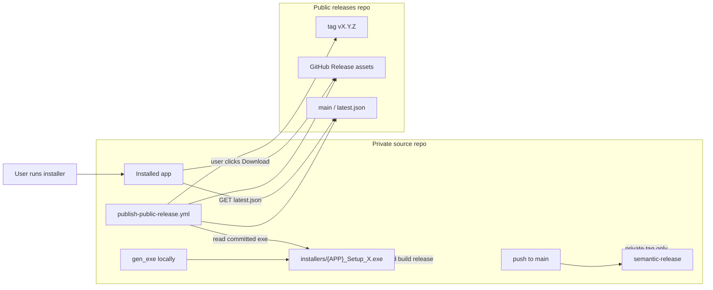

# Update system walkthrough

Portable guide for **notify-only** desktop app updates: the app fetches a public `latest.json`, compares semver, shows a modal when a newer version exists, and opens the installer URL in the browser. No in-app download, no silent install.

Tested pattern: PyWebView + PyInstaller + Inno Setup on Windows. The manifest contract and publish script work for any stack that can HTTP GET JSON and open a URL.

---

## Quick answer: does the user check manually?

| Trigger | Automatic? | Behavior |
|---------|------------|----------|
| App startup | Yes | `checkForUpdates(false)` once after UI load |
| Network fetch | Throttled | At most once per 24h (`update_last_check_at`) |
| **תפריט** → **בדוק עדכון** (or your manual button) | User-initiated | `force=true` — always fetches, always shows toast feedback |
| While app stays open | No | No background polling |

If an update exists and snooze/skip do not apply, a modal appears without user action (on the startup check that actually ran).

---

## Placeholders when porting

Replace these in every copied file. CMS reference values are in the right column.

| Placeholder | Meaning | CMS example |
|-------------|---------|-------------|
| `{APP}` | Short product code (installer filename prefix) | `CMS` |
| `{APP_EXE}` | Frozen executable name | `CMS.exe` |
| `{PUBLIC_OWNER}` | GitHub user/org for public releases repo | `Amirlabai` |
| `{PUBLIC_REPO}` | Public releases repository name | `cms-releases` |
| `{MANIFEST_URL}` | Raw `latest.json` URL | `https://raw.githubusercontent.com/Amirlabai/cms-releases/main/latest.json` |
| `{RELEASES_PAGE}` | GitHub releases latest page (Inno `AppUpdatesURL`) | `https://github.com/Amirlabai/cms-releases/releases/latest` |
| `{ENV_PREFIX}` | Prefix for CI env vars / secrets | `CMS` → `CMS_PUBLIC_RELEASES_REPO`, `CMS_PUBLIC_RELEASES_TOKEN` |
| `{USER_AGENT}` | HTTP User-Agent for manifest fetch | `CMS-UpdateChecker` |
| `{INSTALLER_DIR}` | Git-tracked installer folder | `prod_esential/installers` |
| `{INSTALLER_NAME}` | Setup exe pattern | `{APP}_Setup_{version}.exe` |
| `{USER_DATA_DIR}` | Per-user data (not Program Files) | `%APPDATA%\CMS` → Inno `{userappdata}\{APP}` |

---

## Architecture



| Layer | Responsibility |
|-------|----------------|
| Private repo | Source, secrets, semantic-release (private tag + version bump only). |
| Tracked installer | One `{APP}_Setup_{version}.exe` under `{INSTALLER_DIR}/` (committed). |
| Public repo | `latest.json` on `main` + setup `.exe` on GitHub Releases. No source code. |
| In-app | Fetch manifest, semver compare, snooze/skip, modal, open browser. |
| Installer | Inno in-place upgrade via stable `AppId`; user data in AppData. |

### Design choices

- **Notify-only** — avoids elevated install from inside the app; works with SmartScreen and user consent.
- **Two repos** — private code stays private; app only links to a public binaries repo.
- **`latest.json` on `main`** — stable raw URL, no HTML scraping: `{MANIFEST_URL}`.
- **Manual public publish** — you choose when users see a build (QA, signing). Private tag can exist before public manifest.
- **Tracked installer in private repo** — CI uploads the committed `.exe`; it does not rebuild PyInstaller on GitHub Actions.

---

## Manifest contract (`latest.json`)

```json
{
  "version": "2.20.0",
  "published_at": "2026-06-14T09:12:43Z",
  "installer_url": "https://github.com/{PUBLIC_OWNER}/{PUBLIC_REPO}/releases/download/v2.20.0/{APP}_Setup_2.20.0.exe",
  "release_page": "https://github.com/{PUBLIC_OWNER}/{PUBLIC_REPO}/releases/tag/v2.20.0",
  "notes": "Optional short release notes shown in the update modal."
}
```

| Field | Required | Purpose |
|-------|----------|---------|
| `version` | Yes | Semver `X.Y.Z` (comparison accepts optional `v` prefix). |
| `installer_url` | One of url/page | Direct `.exe` link (preferred). |
| `release_page` | One of url/page | Fallback if `installer_url` missing. |
| `notes` | No | Shown in update modal. |
| `published_at` | No | Informational only. |

Built by `scripts/publish_public_release.py` → `build_manifest()`.

---

## Porting: copy these files

Copy from this repo, then customize per the table below.

| # | Source file | Destination in new app |
|---|-------------|------------------------|
| 1 | `src/utils/update_check.py` | Same path (or your utils package) |
| 2 | `tests/test_update_check.py` | Same path |
| 3 | `scripts/publish_public_release.py` | Same path |
| 4 | `.github/workflows/publish-public-release.yml` | Adapt names/paths |
| 5 | Bridge methods from `src/bridge/api_bridge.py` | Your API/bridge module |
| 6 | Update modal + JS from `src/web/index.html` | Your UI layer |
| 7 | `src/version.py` | Single `__version__` source |
| 8 | `prod_esential/gen_exe_web_app.py` | Your build script (or equivalent) |
| 9 | `prod_esential/create_installer.iss` | Your Inno script |
| 10 | `.github/workflows/release_and_build.yml` | Private semantic-release only |

Optional (recommended for clean upgrades):

| Source | Purpose |
|--------|---------|
| `AppMutex` in `.iss` + `CreateMutexW` in entry script | Block install while app runs; single instance |

CMS does not currently set `AppMutex` or a runtime mutex; Inno still upgrades in place via stable `AppId`.

---

## Per-file customization

### 1. `src/utils/update_check.py`

```python
DEFAULT_MANIFEST_URL = (
    "https://raw.githubusercontent.com/{PUBLIC_OWNER}/{PUBLIC_REPO}/main/latest.json"
)
USER_AGENT = "{APP}-UpdateChecker"
STARTUP_CHECK_INTERVAL = timedelta(hours=24)  # change if needed
SNOOZE_INTERVAL = timedelta(days=1)           # "Later" duration
```

No other logic changes required for a new app.

### 2. `scripts/publish_public_release.py`

| Constant / arg | Change to |
|----------------|-----------|
| `APP_NAME = "CMS"` | `{APP}` |
| `CMS_PUBLIC_RELEASES_REPO` env default | `{ENV_PREFIX}_PUBLIC_RELEASES_REPO` |
| `CMS_PUBLIC_RELEASES_TOKEN` env default | `{ENV_PREFIX}_PUBLIC_RELEASES_TOKEN` |
| `validate_installer_path` expected name | `{APP}_Setup_{version}.exe` |
| `User-Agent` in GitHub requests | `{APP}-publish-public-release` |

CLI:

```text
python scripts/publish_public_release.py \
  --require-token \
  --version X.Y.Z \
  --installer {INSTALLER_DIR}/{APP}_Setup_X.Y.Z.exe \
  --notes "Optional"
```

Dry-run (no token/network write):

```powershell
$env:{ENV_PREFIX}_PUBLIC_RELEASES_REPO = "{PUBLIC_OWNER}/{PUBLIC_REPO}"
.\.venv\Scripts\python.exe scripts\publish_public_release.py `
  --version 2.20.0 `
  --installer prod_esential\installers\{APP}_Setup_2.20.0.exe `
  --dry-run
```

### 3. `src/version.py`

```python
__version__ = 'X.Y.Z'
```

Wire semantic-release (or manual bump) to this file and `MyAppVersion` in the Inno script.

### 4. Bridge API (from `api_bridge.py`)

Add three methods to your JS-exposed API:

```python
from utils import update_check
from version import __version__

def check_for_updates(self, force=False):
    result = update_check.check_for_update(__version__, self.user_config, force=bool(force))
    now = datetime.now(timezone.utc).strftime("%Y-%m-%dT%H:%M:%SZ")
    self.user_config["update_last_check_at"] = now
    save_user_config(self.user_config)  # your persistence helper
    return {"status": "success", **result}

def open_update_download(self, url):
    url = (url or "").strip()
    if not url:
        return {"status": "error", "message": "No download URL provided"}
    if sys.platform == "win32":
        os.startfile(url)
    else:
        webbrowser.open(url)
    return {"status": "success"}

def dismiss_update_notice(self, latest_version, action="later"):
    # action "later" → update_snooze_until = now + SNOOZE_INTERVAL
    # action "skip"   → update_skip_version = latest_version
    ...
```

Return shape from `check_for_updates` (flatten into bridge response):

| `reason` | `update_available` | UI behavior |
|----------|-------------------|-------------|
| `available` | `true` | Show update modal |
| `up_to_date` | `false` | Manual check: success toast |
| `recently_checked` | `false` | Startup skipped fetch; manual: info toast |
| `offline` / `error` | `false` | Manual check: warn/error toast |
| `snooze` / `skipped` | `false` | Manual check: info (update exists but hidden) |

### 5. User config keys (`user_config.json` in AppData)

| Key | Type | Meaning |
|-----|------|---------|
| `update_check_enabled` | bool | `false` disables all checks (default: on). |
| `update_last_check_at` | ISO UTC | Last manifest fetch (24h throttle). |
| `update_snooze_until` | ISO UTC | Hide notice until this time ("Later"). |
| `update_skip_version` | string | Never prompt for this version ("Skip"). |

Store all user data under `{USER_DATA_DIR}`, not `{app}`, so upgrades never wipe config.

### 6. UI layer (HTML/JS or native)

**Modal markup** — copy `<!-- Software update modal -->` block from `src/web/index.html` (`#updateModal`). Include copy that installation is manual (browser download + run setup).

**JavaScript** — copy these functions:

- `showUpdateModal(info)`
- `checkForUpdates(force)`
- `downloadUpdate()` → `open_update_download(installer_url || release_page)`
- `dismissUpdateNotice('later' | 'skip')`

**Startup hook** — after app/UI ready:

```javascript
await checkForUpdates(false);  // respects 24h throttle; shows modal if update available
```

**Manual check** — menu item or button:

```javascript
await checkForUpdates(true);   // always fetches; always shows user feedback
```

Wire labels to your locale. CMS uses **תפריט** → **בדוק עדכון**.

### 7. `prod_esential/create_installer.iss`

```iss
#define MyAppName "{APP}"
#define MyAppVersion "X.Y.Z"
#define MyAppUpdatesURL "https://github.com/{PUBLIC_OWNER}/{PUBLIC_REPO}/releases/latest"
#define MyAppExeName "{APP_EXE}.exe"
OutputBaseFilename={APP}_Setup_{#MyAppVersion}
```

Critical for in-place upgrade:

```iss
[Setup]
AppId={{YOUR-GUID-HERE}}   ; generate once with Inno; NEVER change across releases
AppUpdatesURL={#MyAppUpdatesURL}

[Dirs]
Name: "{userappdata}\{#MyAppName}";

[Files]
Source: "..."; DestDir: "{app}"; Flags: ignoreversion recursesubdirs createallsubdirs
```

Recommended (optional):

```iss
DisableDirPage=auto
DisableProgramGroupPage=auto
CloseApplications=yes
AppMutex={APP}AppMutex
```

Match runtime mutex in `web_app.py` when frozen:

```python
kernel32.CreateMutexW(None, False, "{APP}AppMutex")
```

### 8. `prod_esential/gen_exe_web_app.py`

Ensure it:

1. Reads version from `src/version.py` and verifies Inno `MyAppVersion` matches.
2. Runs PyInstaller → `installer_files_{version}/` (gitignored).
3. Runs `ISCC.exe` on `create_installer.iss`.
4. Outputs `{APP}_Setup_{version}.exe` to `{INSTALLER_DIR}/`.
5. Deletes older `{APP}_Setup_*.exe` in that folder (keep current only).

### 9. `.gitignore`

```gitignore
installer_files_*/
old_installer_files/
!{INSTALLER_DIR}/
!{INSTALLER_DIR}/*.exe
```

### 10. `.github/workflows/publish-public-release.yml`

Copy [`.github/workflows/publish-public-release.yml`](.github/workflows/publish-public-release.yml) and replace:

| CMS value | Your value |
|-----------|------------|
| `CMS_PUBLIC_RELEASES_REPO` | `{ENV_PREFIX}_PUBLIC_RELEASES_REPO` (repository **variable**) |
| `CMS_PUBLIC_RELEASES_TOKEN` | `{ENV_PREFIX}_PUBLIC_RELEASES_TOKEN` (repository **secret**) |
| `prod_esential/installers/CMS_Setup_${VERSION}.exe` | `{INSTALLER_DIR}/{APP}_Setup_${VERSION}.exe` |
| Trigger phrase `add build release` | Keep or change (must match maintainer commit message) |

Triggers:

- Push to `main` when commit message contains `add build release`
- Manual `workflow_dispatch` with optional version override

### 11. `.github/workflows/release_and_build.yml`

Private repo only: tests + semantic-release → bump `src/version.py` + private tag `vX.Y.Z`. **No installer build on CI.**

---

## Public infrastructure setup (new app)

1. Create empty public GitHub repo `{PUBLIC_REPO}` (e.g. `MyApp-releases`).
2. On the **private** repo, add:
   - Variable: `{ENV_PREFIX}_PUBLIC_RELEASES_REPO` = `{PUBLIC_OWNER}/{PUBLIC_REPO}`
   - Secret: `{ENV_PREFIX}_PUBLIC_RELEASES_TOKEN` — PAT with `contents: write` on the public repo (classic token or fine-grained).
3. Push an initial `latest.json` to public `main` or let the first publish create it.

---

## Maintainer runbook

1. Merge conventional commits to private `main`.
2. Confirm semantic-release created private tag `vX.Y.Z` and bumped `src/version.py`.
3. `git pull`, build locally:

   ```powershell
   .\.venv\Scripts\python.exe prod_esential\gen_exe_web_app.py
   ```

4. Verify `{INSTALLER_DIR}\{APP}_Setup_X.Y.Z.exe` exists; older setup exes removed.
5. QA the installer locally (fresh install + upgrade from previous version).
6. Commit and push installer with message containing `add build release` — auto-triggers public publish.
   Or run **Publish public release** manually from Actions.
7. Confirm on public repo: tag `vX.Y.Z`, release asset, raw `{MANIFEST_URL}`.
8. Test in-app: manual check shows new version; startup check shows modal on next day (or after clearing `update_last_check_at`).

Note: the private semver tag may point to a commit before the installer commit. Publish reads the versioned path on `main`, not the private tag tree.

---

## Porting checklist

### Public infrastructure

- [ ] Create `{PUBLIC_OWNER}/{PUBLIC_REPO}` on GitHub
- [ ] Add `{ENV_PREFIX}_PUBLIC_RELEASES_REPO` variable on private repo
- [ ] Add `{ENV_PREFIX}_PUBLIC_RELEASES_TOKEN` secret on private repo

### Versioning

- [ ] Add `src/version.py` as single in-app version
- [ ] Wire semantic-release to version file + Inno `MyAppVersion`

### In-app (copy + customize)

- [ ] `src/utils/update_check.py` — `DEFAULT_MANIFEST_URL`, `USER_AGENT`
- [ ] Bridge: `check_for_updates`, `open_update_download`, `dismiss_update_notice`
- [ ] Update modal HTML + JS (`checkForUpdates`, `downloadUpdate`, `dismissUpdateNotice`)
- [ ] Startup: `checkForUpdates(false)` after UI load
- [ ] Manual check button in menu/toolbar
- [ ] `tests/test_update_check.py` (mock HTTP)

### Installer

- [ ] Generate stable `AppId` once; never change
- [ ] `AppUpdatesURL` → public releases page
- [ ] `OutputBaseFilename` → `{APP}_Setup_{version}`
- [ ] User data in `{userappdata}\{APP}`, not `{app}`
- [ ] `ignoreversion` on program files
- [ ] Optional: `AppMutex` + runtime mutex

### Build + git

- [ ] `gen_exe_web_app.py` chains PyInstaller + Inno → `{INSTALLER_DIR}/`
- [ ] `.gitignore` ignores `installer_files_*/`; tracks `{INSTALLER_DIR}/*.exe`

### CI

- [ ] `release_and_build.yml` — semantic-release only (private tag)
- [ ] `publish-public-release.yml` — upload committed installer to public repo
- [ ] Document runbook for your team

### User-facing

- [ ] Modal states installation is manual (download + run setup)
- [ ] Optional: document `/VERYSILENT` for power users

---

## What this system does not do

| Feature | Status |
|---------|--------|
| Auto-download installer | Not implemented |
| Auto-run installer | Not implemented |
| Delta / patch updates | Full setup each release |
| macOS / Linux | Windows-focused; reuse manifest idea elsewhere |
| Background polling while app open | Startup + manual only |

---

## Reference files (CMS)

| File | Role |
|------|------|
| [`src/utils/update_check.py`](src/utils/update_check.py) | Manifest fetch, semver, throttle, snooze |
| [`src/bridge/api_bridge.py`](src/bridge/api_bridge.py) | `check_for_updates`, `open_update_download`, `dismiss_update_notice` |
| [`src/web/index.html`](src/web/index.html) | Update modal, startup + manual check |
| [`src/version.py`](src/version.py) | `__version__` |
| [`prod_esential/gen_exe_web_app.py`](prod_esential/gen_exe_web_app.py) | PyInstaller + Inno; tracked installer |
| [`prod_esential/installers/`](prod_esential/installers/) | Git-tracked `{APP}_Setup_*.exe` |
| [`prod_esential/create_installer.iss`](prod_esential/create_installer.iss) | Inno installer |
| [`scripts/publish_public_release.py`](scripts/publish_public_release.py) | Public repo publish |
| [`.github/workflows/release_and_build.yml`](.github/workflows/release_and_build.yml) | Private semantic-release |
| [`.github/workflows/publish-public-release.yml`](.github/workflows/publish-public-release.yml) | Public publish |
| [`tests/test_update_check.py`](tests/test_update_check.py) | Unit tests |

---

## Testing locally

**Manifest logic** (no network):

```powershell
.\.venv\Scripts\python.exe -m pytest tests/test_update_check.py -v
```

**Bridge helpers**:

```powershell
.\.venv\Scripts\python.exe -m pytest tests/test_api_bridge.py -k update -v
```

**Build + tracked installer**:

```powershell
.\.venv\Scripts\python.exe prod_esential\gen_exe_web_app.py
```

**Publish dry-run**:

```powershell
$env:CMS_PUBLIC_RELEASES_REPO = "{PUBLIC_OWNER}/{PUBLIC_REPO}"
.\.venv\Scripts\python.exe scripts\publish_public_release.py `
  --version 2.20.0 `
  --installer prod_esential\installers\CMS_Setup_2.20.0.exe `
  --dry-run
```

**Upgrade path** (manual):

1. Install version A from setup.
2. Run setup for version B.
3. Confirm: same install folder, AppData preserved, welcome shows upgrade.

**In-app check**:

Run frozen build; use manual check; confirm modal against real or mocked manifest.

**Throttle test**:

Set `update_last_check_at` to now in `user_config.json`; restart — startup should not fetch. Manual check with `force=true` still fetches.
